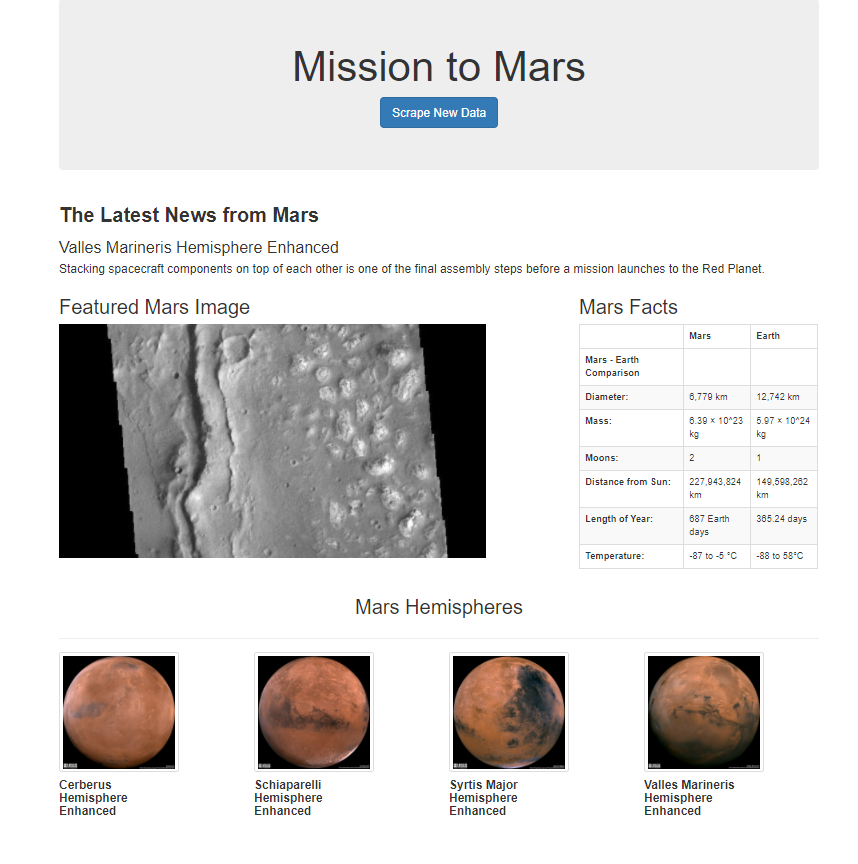

# Web Scraping Challenge - Mission to Mars

## Scraping Mars Data
The [Mission to Mars](Mission_to_Mars\mission_to_mars.ipynb) Jupyter Notebook includes uses BeautifulSoup, Pandas and Splinter to scrape data from the following sites.

> [NASA Mars News Site](https://redplanetscience.com/) - scrapes featured latest news title and paragraph text
 [Mars Space Images](https://spaceimages-mars.com) - scrapes the featured image
  [Mars Facts](https://galaxyfacts-mars.com) - scrapes the table containing facts about Mars
  [Mars Hemispheres](https://marshemispheres.com/) - scrapes the images of the 4 Mars hemispheres and their corresponding titles

## Mars MongoDB and Flask Application

